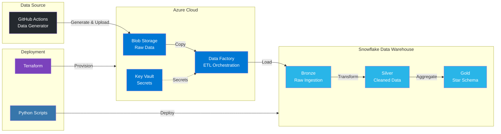

# 🛒 Modern E-commerce Data Engineering Pipeline


## 📖 Overview

This project implements an end-to-end **ELT (Extract, Load, Transform)** pipeline for a high-volume E-commerce platform. It demonstrates a production-grade data engineering workflow, starting from synthetic data generation, through cloud ingestion, up to a multi-layered data warehouse in Snowflake.

The pipeline is fully automated using **GitHub Actions** and **Azure Data Factory**, featuring a robust **Medallion Architecture** (Bronze/Silver/Gold) with **SCD Type 2** history tracking and automated Data Quality checks.

## 🏗 Architecture

The system is designed to be **serverless** and **event-driven**.



## 🗄️ Snowflake Infrastructure

The Snowflake data warehouse implements a **Medallion Architecture** with three distinct layers, each serving a specific purpose in the data transformation pipeline.

### 📊 Database Structure

The `ECOMMERCE` database contains four schemas:

- **`COMMON`** - Shared infrastructure and metadata
  - `ETL_LOGS` - Centralized logging table for all ETL operations
  - `DQ_ERRORS` - Quarantine table for records failing data quality checks
  - `BRONZE_INGESTION_CONFIG` - Configuration table for dynamic Bronze ingestion

- **`BRONZE`** - Raw data ingestion layer
  - Stores raw JSON data as-is from Azure Blob Storage
  - Tables: `orders`, `order_items`, `order_status_history`, `payments`, `shipments`, `products`, `customers`, `addresses`
  - Each table has a corresponding **Stream** for change data capture (CDC)
  - Data retention: 14 days

- **`SILVER`** - Cleaned and validated data layer
  - Structured tables with proper data types and constraints
  - Data quality checks applied before ingestion
  - Deduplication and latest-state tracking
  - Tables mirror Bronze structure with cleaned schemas
  - Streams available for downstream processing
  - Data retention: 14 days

- **`GOLD`** - Business-ready analytics layer
  - Star schema dimensional model
  - Fact and dimension tables optimized for reporting
  - Pre-aggregated metrics and business KPIs
  - Data retention: 7 days

### 📝 ETL Logging System

The `ECOMMERCE.COMMON.ETL_LOGS` table provides comprehensive logging for all ETL operations:

- **Pipeline Tracking**: Links logs to Azure Data Factory pipeline run IDs
- **Layer Identification**: Tracks which layer (Bronze/Silver/Gold) the operation belongs to
- **Performance Metrics**: Records execution duration, rows affected, and error counts
- **Error Details**: Captures error codes, stack traces, and custom messages
- **Audit Trail**: Includes Snowflake query IDs, session info, warehouse, user, and role
- **Flexible Metadata**: Additional JSON field for custom debug information

All stored procedures use the `LOG_EVENT()` procedure to record:
- Process start/completion
- Success/failure status
- Row counts and error statistics
- Execution timing

### ✅ Data Quality Framework

The `ECOMMERCE.COMMON.DQ_ERRORS` table implements a robust data quality quarantine system:

- **Automatic Validation**: Records failing quality checks are captured before processing
- **Error Classification**: Categorizes errors by type (e.g., `NEGATIVE_AMOUNT`, `MISSING_CUSTOMER`, `NULL_KEY`)
- **Full Record Preservation**: Stores the complete raw record (JSON) for investigation
- **Traceability**: Links errors to specific pipeline runs, layers, and source objects

**Data Quality Checks Include:**
- Negative amounts (orders, payments, products)
- Missing required fields (customer IDs, dates, keys)
- Empty or null critical values
- Referential integrity violations

Records that fail validation are quarantined in `DQ_ERRORS` and excluded from Silver layer processing, ensuring data integrity while maintaining full auditability.

### 🔄 Change Data Capture (Streams)

Snowflake **Streams** provide real-time change detection:

- **Bronze Streams**: Monitor raw data ingestion, triggering Silver layer transformations
- **Silver Streams**: Track changes in cleaned data, enabling incremental Gold layer updates
- **Append-Only Mode**: Bronze streams use append-only mode for efficient new data detection
- **Metadata Tracking**: Streams include `metadata$action` to distinguish INSERT/UPDATE/DELETE operations

Stored procedures read from streams to process only new or changed records, optimizing performance and reducing processing costs.

### ⚙️ Stored Procedures

Transformation logic is encapsulated in stored procedures:

- **Bronze Layer**: `LOAD_BRONZE_MASTER()` - Dynamically loads files from Azure Blob Storage based on configuration table
- **Silver Layer**: Individual procedures for each entity (e.g., `LOAD_SILVER_ORDERS()`, `LOAD_SILVER_PRODUCTS()`) that:
  - Read from Bronze streams
  - Apply data quality checks
  - Perform deduplication using hash values
  - Merge data with SCD Type 2 support
  - Log all operations
- **Gold Layer**: Aggregation procedures that build star schema from Silver layer data

All procedures are transaction-safe, include comprehensive error handling, and provide detailed logging.

### 🔒 Security & Access Control

- **Dedicated Warehouse**: `ETL_WH` (X-SMALL, auto-suspend enabled) for cost optimization
- **Role-Based Access**: Separate roles for ETL operations and BI/reporting
- **Azure Integration**: Secure OAuth-based storage integration for Azure Blob Storage access
- **Service Accounts**: Dedicated service users for ETL and BI workloads with separate password management

## 🚀 Quick Start

### Prerequisites

- **Azure CLI** installed and configured
- **PowerShell** (Windows or PowerShell Core)
- **Azure Subscription** with appropriate permissions
- **GitHub Account** with repository creation permissions
- **Snowflake Account** with admin access
- **Python 3.12+** (for local development)

### Initial Setup

1. **Clone the repository locally**
   ```powershell
   git clone https://github.com/krzysztof-piechowski/ecommerce-elt-pipeline.git
   cd ecommerce-etl-pipeline
   ```

2. **Run the bootstrap script**
   ```powershell
   .\ops\bootstrap.ps1
   ```
   
   This script will:
   - Create an Azure Resource Group (`rg-ecommerce-tfstate`) for Terraform state storage
   - Create a Storage Account and Blob Container for Terraform backend
   - Generate a Service Principal for GitHub Actions with appropriate Azure RBAC roles
   - Create a custom Azure role for constrained delegation to Snowflake
   - Generate a local `terraform/backend.conf` file for reference
   - Display the required GitHub secrets at the end

3. **Create a GitHub repository**
   - Create a new repository on GitHub
   - Add the remote and push your local code:
     ```powershell
     git remote add origin <your-github-repo-url>
     git push -u origin main
     ```

4. **Configure GitHub Secrets**

   The bootstrap script will output the required secrets. Add them to your GitHub repository under **Settings → Secrets and variables → Actions**.

   **Azure Configuration (Single JSON Secret):**
   - Secret Name: `AZURE_CONFIG`
   - Value: Copy the entire JSON block displayed by `bootstrap.ps1`, which includes:
     - `clientId` - Service Principal App ID
     - `clientSecret` - Service Principal password
     - `subscriptionId` - Azure Subscription ID
     - `tenantId` - Azure Tenant ID
     - `resourceGroupName` - Terraform state resource group
     - `tfStateStorageAccount` - Terraform state storage account name
     - `snowflakePrincipalId` - Snowflake Service Principal Object ID

   **Snowflake Secrets (5 separate secrets):**
   - `SNOWFLAKE_ACCOUNT` - Your Snowflake account identifier
   - `SNOWFLAKE_USER` - Snowflake admin user for deployment
   - `SNOWFLAKE_PASSWORD` - Password for the admin user
   - `SNOWFLAKE_ETL_PASSWORD` - Password for the ETL service user (create a new one)
   - `SNOWFLAKE_BI_PASSWORD` - Password for the BI service user (create a new one)

5. **Push to GitHub and let GitHub Actions handle the rest**

   Once you push your code to the `main` branch, the `deploy_infra.yml` workflow will automatically:
   - Deploy Azure infrastructure using Terraform (Storage Account, Key Vault, Data Factory)
   - Deploy Snowflake objects (databases, schemas, tables, stored procedures, streams)
   - Configure Azure Data Factory linked services and pipelines
   - Set up RBAC for Snowflake to access Azure Blob Storage

## 📋 GitHub Actions Workflows

### 1. Deploy Infrastructure & Code (`deploy_infra.yml`)

**Triggers:**
- Push to `main` branch (excluding README.md and .gitignore changes)
- Manual workflow dispatch

**What it does:**
- Authenticates to Azure using the Service Principal
- Initializes Terraform with remote backend (Azure Blob Storage)
- Provisions Azure resources:
  - Resource Group (`rg-ecommerce-dev`)
  - Storage Account with hierarchical namespace (ADLS Gen2)
  - Key Vault for storing secrets
  - Azure Data Factory instance
- Deploys Snowflake infrastructure:
  - Databases, schemas, and tables
  - Stored procedures for data transformation
  - Streams for change data capture (CDC)
- Configures Azure Data Factory:
  - Linked Services (Key Vault, Snowflake)
  - Main ETL pipeline
- Assigns RBAC roles for Snowflake to access Azure Storage

### 2. Generate Data & Run ETL (`seed_data.yml`)

**Triggers:**
- Manual workflow dispatch
- Scheduled daily at 19:00 UTC (cron: `0 19 * * *`)

**What it does:**
- Generates synthetic e-commerce data (orders, customers, products, etc.)
- Uploads data to Azure Blob Storage (`raw` container)
- Triggers the Azure Data Factory pipeline to process the data
- Cleans up firewall rules after completion

## 🛠 Local Development

### Deploy Local Changes (`deploy_local.ps1`)

For faster iteration on Snowflake procedures and SQL changes, use the local deployment script:

```powershell
.\ops\deploy_local.ps1
```

**Prerequisites:**
- Azure infrastructure must already exist (deployed via GitHub Actions)
- You must be logged into Azure CLI (`az login`)
- Your IP will be automatically whitelisted for storage access

**What it does:**
- Detects existing Azure infrastructure using resource tags
- Configures your local environment with necessary variables
- Grants you temporary RBAC access to Azure Storage
- Deploys Snowflake objects (procedures, SQL scripts) without regenerating data
- **Note:** This is a partial alternative to `deploy_infra.yml` - it only handles Snowflake code deployment, not Azure infrastructure

**Use cases:**
- Testing changes to Snowflake stored procedures
- Modifying SQL transformation logic
- Quick iteration without triggering full CI/CD pipeline

## 🧹 Cleanup

To remove all Azure infrastructure created by this project:

```powershell
.\ops\cleanup.ps1
```

**What it removes:**
- Service Principal (`sp-ecommerce-github-actions`)
- Custom Azure role (`Snowflake Access Granter (Restricted)`)
- Resource Groups:
  - `rg-ecommerce-tfstate` (Terraform state)
  - `rg-ecommerce-dev` (Application resources)
- Local configuration files (`terraform/backend.conf`, etc.)

**Note:** The Snowflake Service Principal (global Microsoft Entra ID object) is **not** removed by default, as it's a shared resource.

## 📁 Project Structure

```
ecommerce-etl-pipeline/
├── .github/
│   └── workflows/
│       ├── deploy_infra.yml      # Infrastructure & code deployment
│       └── seed_data.yml         # Data generation & ETL trigger
├── adf_objects/                  # Azure Data Factory definitions
│   ├── ls_keyvault.json          # Key Vault linked service
│   ├── ls_snowflake.json         # Snowflake linked service
│   └── pipeline.json             # Main ETL pipeline
├── ops/                          # Operations scripts
│   ├── bootstrap.ps1             # Initial Azure setup
│   ├── deploy_local.ps1          # Local Snowflake deployment
│   ├── cleanup.ps1               # Infrastructure cleanup
│   └── utils.ps1                 # Shared utility functions
├── scripts/                      # Python deployment scripts
│   ├── deploy_snowflake.py       # Snowflake object deployment
│   ├── oltp_data_generator.py    # Synthetic data generation
│   ├── common_logger.py          # Logging utilities
│   └── requirements.txt          # Python dependencies
├── snowflake_sql/                # Snowflake SQL scripts
│   ├── 01_SETUP_INFRASTRUCTURE.sql  # Database, schemas, tables
│   └── 02_REGISTER_PROCEDURES.sql   # Stored procedures and streams
└── terraform/                    # Infrastructure as Code
    ├── main.tf                   # Main resource definitions
    ├── variables.tf              # Input variables
    ├── outputs.tf                # Output values
    └── providers.tf              # Terraform providers
```

## 🔧 Technologies Used

- **Azure Services:**
  - Azure Blob Storage (ADLS Gen2) - Data lake storage
  - Azure Data Factory - ETL orchestration
  - Azure Key Vault - Secret management
  - Azure RBAC - Access control

- **Snowflake:**
  - Data Warehouse with Medallion Architecture
  - Streams - Change data capture (CDC)
  - Stored Procedures - Transformation logic
  - SCD Type 2 - Historical data tracking

- **DevOps:**
  - Terraform - Infrastructure as Code
  - GitHub Actions - CI/CD automation
  - Azure CLI - Resource management

- **Languages:**
  - Python 3.12 - Deployment scripts & data generation
  - SQL - Data transformation logic
  - PowerShell - Automation scripts

## 🔐 Security Features

- **Network Security:** Storage accounts use firewall rules (default deny, allow Azure Services)
- **RBAC:** Least-privilege access with custom roles and assignment conditions
- **Secret Management:** Passwords stored in Azure Key Vault
- **Service Principal:** Dedicated identity for GitHub Actions with constrained permissions
- **Snowflake Integration:** Secure OAuth-based authentication with Azure

## 📝 Notes

- The bootstrap script creates resources in the `switzerlandnorth` region by default
- Terraform state is stored remotely in Azure Blob Storage for team collaboration
- All resources are tagged with `Project=Ecommerce-ETL` for easy identification
- The pipeline uses a Medallion Architecture (Bronze → Silver → Gold) for data quality and governance

## 🤝 Contributing

1. Make your changes locally
2. Test using `deploy_local.ps1` for Snowflake changes
3. Push to a feature branch
4. Create a pull request to `main`
5. GitHub Actions will validate and deploy on merge

## 📬 Contact

Created by **Krzysztof Piechowski** - feel free to contact me!
* **Email**: krzysztof_piechowski@outlook.com
* **LinkedIn**: [View Profile](https://linkedin.com/in/krzysztof-piechowski)
* **GitHub**: [Browse Code](https://github.com/krzysztof-piechowski)

## 📄 License

See [LICENSE](LICENSE) file for details.
